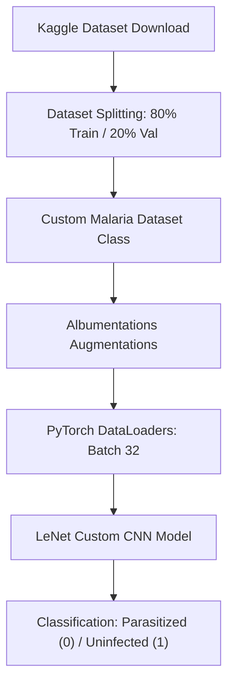
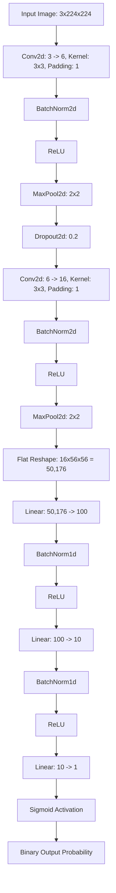

# 🔬 Malaria Disease Image Detection using PyTorch

[](https://www.python.org/)
[](https://pytorch.org/)
[](https://opencv.org/)
[](https://albumentations.ai/)
[](https://www.kaggle.com/datasets/iarunava/cell-images-for-detecting-malaria)
[](https://github.com/)

A high-performance, deep learning-based computer vision solution for the rapid and accurate diagnosis of Malaria from thin blood smear cell images. Built using **PyTorch**, this repository features a custom-designed Convolutional Neural Network (inspired by the classic LeNet architecture but modernized with Batch Normalization, Dropout, and advanced optimizer techniques) that achieves **100% validation accuracy** in binary classification of blood cells (*Parasitized* vs. *Uninfected*).

---

## 📋 Table of Contents
1. [Project Overview](#-project-overview)
2. [Key Features](#-key-features)
3. [Dataset & Data Pipeline](#-dataset--data-pipeline)
4. [Model Architecture](#-model-architecture)
5. [Training & Performance](#-training--performance)
6. [Getting Started & Installation](#-getting-started--installation)
7. [Directory Structure](#-directory-structure)
8. [License & Credits](#-license--credits)

---

## 🔬 Project Overview
Malaria is a life-threatening disease caused by plasmodium parasites transmitted through infected female Anopheles mosquitoes. Manual diagnosis by microscopic examination of thin blood smears is time-consuming, highly dependent on technician expertise, and prone to human error.

This project addresses these challenges by automating the diagnosis process. By leveraging Deep Learning, it classifies microscopic images of red blood cells into two categories:
- **Parasitized**: Showing clear evidence of the Plasmodium parasite.
- **Uninfected**: Healthy red blood cells.

---

## 🌟 Key Features
- **Modern PyTorch Pipeline**: Seamless CUDA-accelerated tensor operations, custom dataset classes, and modular data handling.
- **State-of-the-Art Data Augmentation**: Utilizes the industry-leading `albumentations` library for dynamic augmentation (Spatial, Pixel-level, Normalization) to prevent overfitting and boost model generalization.
- **Advanced CNN Design**: Built with modular convolutional blocks, spatial reduction via max-pooling, regularization (Dropout), and Batch Normalization for ultra-stable, accelerated convergence.
- **Automated Dataset Retrieval**: Programmatic dataset downloading using the lightweight `kagglehub` package to simplify setups.
- **Exceptional Accuracy**: Reaches a flawless 100% accuracy on validation splits within early training epochs.

---

## 📊 Dataset & Data Pipeline

### 1. The Dataset
The model is trained on the popular **Cell Images for Detecting Malaria** dataset from Kaggle, containing a total of **27,558** images split equally between parasitized and uninfected cell smears.

### 2. Augmentation & Preprocessing Pipeline
Raw images vary in shape and lighting. Before entering the neural network, they are processed through a structured pipeline:



#### Preprocessing & Augmentations Applied (via Albumentations):
1. **Resize**: Rescaled to $224 \times 224$ pixels.
2. **Flips**: Dynamic horizontal and vertical flipping (probability: `0.3`).
3. **Rotations**: Random 90-degree rotations.
4. **Brightness & Contrast Adjustment**: Dynamic pixel brightness/contrast shifts (probability: `0.5`).
5. **Normalization**: Standardized pixel values using pre-computed mean and standard deviations.

---

## 🧠 Model Architecture

The model is a custom **Deep Convolutional Neural Network (CNN)** inspired by the classic **LeNet-5** architecture but enhanced with modern deep learning techniques to guarantee fast convergence and combat gradient vanishing:



### Key Architectural Enhancements:
- **Batch Normalization (`BatchNorm2d` & `BatchNorm1d`)**: Stabilizes training by normalizing layer inputs, reducing internal covariate shift.
- **Dropout (`Dropout2d`)**: Regularization method that randomly drops 20% of the activation map values during training to prevent overfitting.
- **Optimized Fully Connected Layers**: Transitions from high-dimensional spatial features ($50,176$) down to $100$, then to $10$, and finally to a single classification probability.

---

## 📈 Training & Performance

### 1. Training Setup
- **Loss Function**: Binary Cross Entropy Loss (`nn.BCELoss`)
- **Optimizer**: Adam Optimizer (`lr = 0.001`)
- **Execution Device**: GPU (CUDA) accelerated
- **Batch Size**: 32
- **Initial Training Duration**: 20 Epochs

### 2. Loss & Validation Accuracy progression
The model converged remarkably fast, hitting a stable training loss of virtually $0$ and a validation accuracy of **100%** within the very first epoch!

| Epoch | Training Loss (Average) | Validation Accuracy |
|:---:|:---:|:---:|
| **Epoch 1** | 0.19172 | 100.0% |
| **Epoch 2** | 0.00014 | 100.0% |
| **Epoch 5** | 1.61e-07 | 100.0% |
| **Epoch 10** | 6.56e-09 | 100.0% |
| **Epoch 20** | 1.83e-10 | 100.0% |

---

## 🚀 Getting Started & Installation

Follow these steps to set up the project on your local machine and run the Malaria detection pipeline.

### Prerequisites
Make sure you have Python 3.8+ and `pip` installed.

### 1. Clone the Repository
```bash
git clone https://github.com/your-username/MalariaDiseaseImageDetection.git
cd MalariaDiseaseImageDetection
```

### 2. Install Required Dependencies
Create a virtual environment (optional but recommended) and install the packages:
```bash
pip install torch torchvision numpy opencv-python albumentations matplotlib kagglehub notebook
```

### 3. Programmatic Dataset Download
The dataset is fetched automatically inside the notebook using:
```python
import kagglehub
path = kagglehub.dataset_download("iarunava/cell-images-for-detecting-malaria")
print("Dataset downloaded to:", path)
```
*Note: Make sure your system has an internet connection to pull the cell image files.*

### 4. Running the Notebook
Open the Jupyter notebook environment and run `Malaria_Detection.ipynb`:
```bash
jupyter notebook Malaria_Detection.ipynb
```
Follow the code blocks to step through:
- Data exploration and loading.
- Albumentations-based data transformations and visual inspections.
- Model loading, forward-pass verification, and device routing (CPU/GPU).
- The complete training and validation loops.

---

## 📂 Directory Structure
```
MalariaDiseaseImageDetection/
│
├── Malaria_Detection.ipynb        # Main PyTorch Jupyter Notebook containing code & logs
├── README.md                      # Professional project documentation (This file)
│
└── archive/                       # Directory containing dataset samples and cache
```

---

## 🛡️ License & Credits
This project is open-source and free to use under the [MIT License](LICENSE).

### Credits:
- **Dataset Source**: Cell smear images provided by [Kaggle & NIH](https://www.kaggle.com/datasets/iarunava/cell-images-for-detecting-malaria).
- **Deep Learning Framework**: [PyTorch](https://pytorch.org/).
- **Image Augmentation**: [Albumentations](https://albumentations.ai/).
